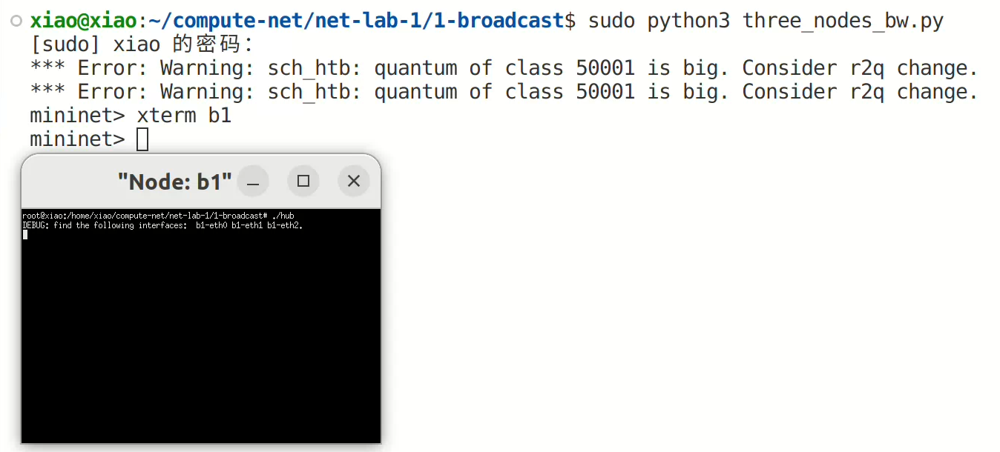

# **广播网络实验**

2024年11月11日

2024E8013282087-陈潇

## 实验内容

**实现节点广播的broadcast_packet函数**

+ 设计思路

  在已有代码框架的基础上实现 `broadcast.c`中的 `broadcast_packet`函数。通过阅读代码和实验指导PPT，可以使用 `iface_send_packet`函数来补全所需函数，代码如下：

  ```cpp
  #include "base.h"
  #include <stdio.h>
  extern ustack_t *instance;

  void broadcast_packet(iface_info_t *iface, const char *packet, int len)
  {
  	// TODO: broadcast packet 
  	iface_info_t *ifa = NULL;
  	list_for_each_entry(ifa, &instance->iface_list, list){
  		if(ifa->index!=iface->index)
  		{
  			iface_send_packet(ifa,packet,len);
  			// fprintf(stdout, "TODO: broadcast packet.\n");
  		}
  //		if(memcmp(&iface->mac,&ifa->mac,sizeof(iface->mac)))
  	}

  }
  ```

**验证广播网络能够正常运行**

- 从一个端节点ping另一个端节点

  运行 `three_nodes_bw.py`，在b1节点中打开 `./hub`，然后开始三个节点互相 `ping`

  

  
  **验证广播网络的效率**
- 在 `three_nodes_bw.py`进行 `iperf`测量链路的利用效率
- 两种场景：

* `H1`: `iperf client`; `H2`, `H3`: `servers `（`h1`同时向 `h2`和 `h3`测量）

  
  上图中 `h1`向 `h2`、`h3`节点测量，可以看到 `h1`向 `h2`和 `h3`发送带宽分别为 `5.09Mbps`和 `4.37Mbps`。`h2`和 `h3`的接收带宽分别为 `5.09Mbps`和 `4.37Mbps`。在拓扑文件中，`h1->b1`的带宽为 `20Mbps`，`b1->h2`、`b1->h3`的带宽为 `10Mbps`。因此带宽利用率分别为：`47.3%`。
* `H1`: `iperf server`; `H2`,` H3`: `clients` （ `h2`和 `h3` 同时向 `h1`测量）

  
  上图中 `h2`、`h3`向 `h1`节点测量，可以看到 `h2`和 `h3`向 `h1`发送带宽分别为 `8.96Mbps`和 `8.95Mbps`。`h1`的接收带宽分别为 `8.99Mbps`和 `8.96Mbps`。在拓扑文件中，`h1->b1`的带宽为 `20Mbps`，`b1->h2`、`b1->h3`的带宽为 `10Mbps`。因此带宽利用率分别为：`89.65%`。

**自己动手构建环形拓扑，验证该拓扑下节点广播会产生数据包环路**

- 改写框架中的 `three_nodes_bw.py`文件实现了一个环形拓扑文件，实现在 `ring_topo.py`中，代码如下：

```python
#!/usr/bin/python

from __future__ import print_function

import os
import sys
import glob

from mininet.topo import Topo
from mininet.net import Mininet
from mininet.link import TCLink
from mininet.cli import CLI

script_deps = [ 'ethtool' ]

def check_scripts():
    dir = os.path.abspath(os.path.dirname(sys.argv[0]))
  
    for fname in glob.glob(dir + '/' + 'scripts/*.sh'):
        if not os.access(fname, os.X_OK):
            print('%s should be set executable by using `chmod +x $script_name`' % (fname))
            sys.exit(1)

    for program in script_deps:
        found = False
        for path in os.environ['PATH'].split(os.pathsep):
            exe_file = os.path.join(path, program)
            if os.path.isfile(exe_file) and os.access(exe_file, os.X_OK):
                found = True
                break
        if not found:
            print('`%s` is required but missing. which could be installed via `apt` or `aptitude`' % (program))
            sys.exit(2)

# Mininet will assign an IP address for each interface of a node 
# automatically, but hub or switch does not need IP address.
def clearIP(n):
    for iface in n.intfList():
        n.cmd('ifconfig %s 0.0.0.0' % (iface))

class BroadcastTopo(Topo):
    def build(self):
        # add three hubs (b1, b2, b3)
        b1 = self.addHost('b1')
        b2 = self.addHost('b2')
        b3 = self.addHost('b3')

        # add two hosts (h1, h2)
        h1 = self.addHost('h1')
        h2 = self.addHost('h2')

        # create a circular link
        self.addLink(b1, b2, bw=10)
        self.addLink(b2, b3, bw=10)
        self.addLink(b3, b1, bw=10)

        # link hosts to switches
        self.addLink(h1, b1, bw=10)
        self.addLink(h2, b2, bw=10)

if __name__ == '__main__':
    check_scripts()

    topo = BroadcastTopo()
    net = Mininet(topo = topo, link = TCLink, controller = None)

    h1, h2, b1, b2, b3 = net.get('h1', 'h2', 'b1', 'b2', 'b3')
    h1.cmd('ifconfig h1-eth0 10.0.0.1/8')
    h2.cmd('ifconfig h2-eth0 10.0.0.2/8')
    clearIP(b1)
    clearIP(b2)
    clearIP(b3)

    for h in [h1, h2, b1, b2, b3]:
        h.cmd('./scripts/disable_offloading.sh')
        h.cmd('./scripts/disable_ipv6.sh')

    net.start()
    CLI(net)
    net.stop()
```

使用 `h1` ping `h2`


通过wireshark抓包


从结果可以看出数据包在拓扑中被不断转发
