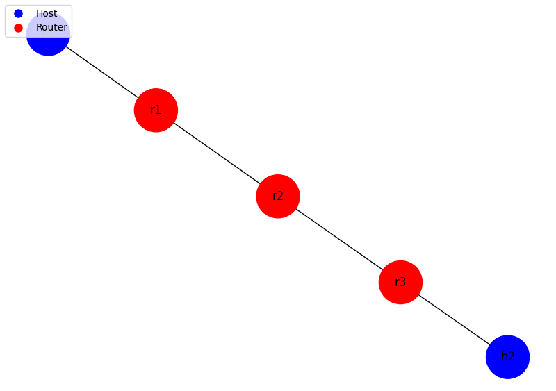

# **路由器转发实验**

2024年12月1日

2024E8013282087-陈潇

## 实验内容

**在主机上安装arptables, iptables，用于禁止每个节点的相应功能**

  ```shell
    sudo apt install arptables iptables
  ```

**运行给定网络拓扑(router_topo.py)**
**在r1上执行路由器程序****在h1上进行ping实验**
  + 设计思路
    在已有代码框架的基础上完成 `arp.c`，实现ARP包的回复和请求，以及对ARP包的处理。

    - 实现 `create_arp_packet(iface_info_t *iface, u32 dst_ip, struct ether_arp *req_hdr, int is_reply)`
      函数描述：为了减少代码的重复，我将 `ARP`请求和 `ARP`响应的包构建逻辑提取到了一个名为 `create_arp_packet` 的辅助函数中。这样，无论是发送 `ARP`请求还是回复，都能通过调用该函数来生成 `ARP`包，避免了冗余的代码。
      代码实现：

    ```cpp
    // Utility function to create an ARP packet
    static char* create_arp_packet(iface_info_t *iface, u32 dst_ip, struct ether_arp *req_hdr, int is_reply)
    {
        char *packet = (char *)malloc(sizeof(struct ether_header) + sizeof(struct ether_arp));
        struct ether_header *header = (struct ether_header *)packet;
        struct ether_arp *arp = (struct ether_arp *)(packet + sizeof(struct ether_header));

        // Fill ether_header
        header->ether_type = htons(ETH_P_ARP);
        memcpy(header->ether_shost, iface->mac, ETH_ALEN);

        if (is_reply) {
            memcpy(header->ether_dhost, req_hdr->arp_sha, ETH_ALEN); // For ARP reply, set destination MAC to source MAC of request
        } else {
            memset(header->ether_dhost, 0xff, ETH_ALEN); // For ARP request, broadcast
        }

        // Fill arp header
        arp->arp_hrd = htons(ARPHRD_ETHER);
        arp->arp_pro = htons(0x0800);
        arp->arp_hln = 6;
        arp->arp_pln = 4;
        arp->arp_op = htons(is_reply ? ARPOP_REPLY : ARPOP_REQUEST);

        memcpy(arp->arp_sha, iface->mac, ETH_ALEN);
        memset(arp->arp_tha, 0, ETH_ALEN); // Target hardware address is zero in requests
        arp->arp_spa = htonl(iface->ip);
        arp->arp_tpa = htonl(dst_ip);

        return packet;
    }
    ```
    - `arp_send_request(iface_info_t *iface, u32 dst_ip)`
      函数描述：发送 `ARP`响应，目标是广播地址。
      代码实现：

    ```cpp
    void arp_send_request(iface_info_t *iface, u32 dst_ip)
    {
        char *packet = create_arp_packet(iface, dst_ip, NULL, 0);  // 传递0表示请求
        iface_send_packet(iface, packet, sizeof(struct ether_header) + sizeof(struct ether_arp));
    }
    ```
    - `arp_send_reply(iface_info_t *iface, struct ether_arp *req_hdr)`
      函数描述：发送 `ARP`响应，目标是 `ARP`请求中的源 `MAC`。
      代码实现：

    ```cpp
    void arp_send_reply(iface_info_t *iface, struct ether_arp *req_hdr)
    {
        char *packet = create_arp_packet(iface, ntohl(req_hdr->arp_spa), req_hdr, 1);  // 传递1表示回复
        iface_send_packet(iface, packet, sizeof(struct ether_header) + sizeof(struct ether_arp));
    }
    ```
    - `handle_arp_packet(iface_info_t *iface, char *packet, int len)`
      函数描述：处理接收到的 `ARP`包。根据 `ARP`包中的操作类型 `（arp_op）`，判断是请求还是回复，并作出相应的处理：
      * `ARP`请求：如果目标 `IP`是本机 `IP`，则发送 `ARP`回复，并将请求中的源 `IP`和源 `MAC`插入到 `ARP`缓存中。
      * `ARP`回复：将源 `IP`和源 `MAC`插入到 `ARP`缓存中。
        代码实现：

    ```cpp
    void handle_arp_packet(iface_info_t *iface, char *packet, int len)
    {
        struct ether_arp *arp = (struct ether_arp *)(packet + sizeof(struct ether_header));

        switch (ntohs(arp->arp_op)) {
            case ARPOP_REQUEST:
                if (ntohl(arp->arp_tpa) == iface->ip) {
                    arp_send_reply(iface, arp);
                }
                arpcache_insert(htonl(arp->arp_spa), arp->arp_sha);
                break;
            case ARPOP_REPLY:
                arpcache_insert(htonl(arp->arp_spa), arp->arp_sha);
                break;
            default:
                free(packet);
                break;
        }
    }

    ```
    - `iface_send_packet_by_arp(iface_info_t *iface, u32 dst_ip, char *packet, int len)`
      函数描述：该函数通过查找 `ARP`缓存来发送 `IP`包。如果目标 `IP`的 `MAC`地址已经缓存，则直接将目标 `MAC`填入以太网头并发送；否则，先将 `IP`包挂起，并发送 `ARP`请求以查询目标 `MAC`。
      代码实现：

    ```cpp
    void iface_send_packet_by_arp(iface_info_t *iface, u32 dst_ip, char *packet, int len)
    {
        struct ether_header *eh = (struct ether_header *)packet;
        memcpy(eh->ether_shost, iface->mac, ETH_ALEN);
        eh->ether_type = htons(ETH_P_IP);

        u8 dst_mac[ETH_ALEN];
        int found = arpcache_lookup(dst_ip, dst_mac);

        if (found) {
            memcpy(eh->ether_dhost, dst_mac, ETH_ALEN);
            iface_send_packet(iface, packet, len);
        } else {
            arpcache_append_packet(iface, dst_ip, packet, len);
        }
    }

    ```
    在已有代码框架的基础上完成 `arpcache.c`，实现ARP缓存相关操作

    - 实现 `int arpcache_lookup(u32 ip4, u8 mac[ETH_ALEN])`
      函数描述：查询 `ARP`缓存，如果查到就返回 `1`，没查到返回 `0`。
      代码实现：

    ```cpp
    // lookup the IP->mac mapping
    int arpcache_lookup(u32 ip4, u8 mac[ETH_ALEN])
    {
        pthread_mutex_lock(&arpcache.lock);
        for (int i = 0; i < MAX_ARP_SIZE; i++) {
            if (arpcache.entries[i].ip4 == ip4 && arpcache.entries[i].valid) {
                memcpy(mac, arpcache.entries[i].mac, ETH_ALEN);
                pthread_mutex_unlock(&arpcache.lock);
                return 1;
            }
        }
        pthread_mutex_unlock(&arpcache.lock);
        return 0;
    }
    ```
    - `void arpcache_append_packet(iface_info_t *iface, u32 ip4, char *packet, int len)`
      函数描述：将要发送的数据包添加到待发送数据包队列中。
      代码实现：

    ```cpp
    // append the packet to arpcache
    void arpcache_append_packet(iface_info_t *iface, u32 ip4, char *packet, int len)
    {
        pthread_mutex_lock(&arpcache.lock);
        int uncached = 1;
        struct arp_req *entry, *q;
        struct cached_pkt *pkt = (struct cached_pkt *)malloc(sizeof(struct cached_pkt));
        pkt->len = len;
        pkt->packet = packet;
        init_list_head(&pkt->list);

        // Search for an existing entry in the request list
        list_for_each_entry_safe(entry, q, &arpcache.req_list, list)
        {
            if (entry->ip4 == ip4) {
                list_add_tail(&pkt->list, &(entry->cached_packets));
                uncached = 0;
                break;
            }
        }

        if (uncached == 1) {
            // Create a new request entry if not found
            struct arp_req *new_req = (struct arp_req *)malloc(sizeof(struct arp_req));
            init_list_head(&new_req->list);
            new_req->iface = iface;
            new_req->ip4 = ip4;
            new_req->sent = time(NULL);
            new_req->retries = 0;
            init_list_head(&new_req->cached_packets);
            list_add_tail(&new_req->list, &arpcache.req_list);
            list_add_tail(&pkt->list, &new_req->cached_packets);
            arp_send_request(iface, ip4);
        }

        pthread_mutex_unlock(&arpcache.lock);
    }
    ```
    - `void arpcache_insert(u32 ip4, u8 mac[ETH_ALEN])`
      函数描述：将新的对应关系插入缓存，并检查是否存在等待该关系的数据包。
      代码实现：

    ```cpp
    void arpcache_insert(u32 ip4, u8 mac[ETH_ALEN])
    {
        pthread_mutex_lock(&arpcache.lock);
        int idx = find_empty_entry(ip4);

        // If an empty entry is found, insert the new entry
        if (idx >= 0) {
            arpcache.entries[idx].ip4 = ip4;
            memcpy(arpcache.entries[idx].mac, mac, ETH_ALEN);
            arpcache.entries[idx].added = time(NULL);
            arpcache.entries[idx].valid = 1;
        } else {
            // If no empty entry is available, replace a random entry
            srand(time(NULL));
            int index = rand() % MAX_ARP_SIZE;
            arpcache.entries[index].ip4 = ip4;
            memcpy(arpcache.entries[index].mac, mac, ETH_ALEN);
            arpcache.entries[index].added = time(NULL);
            arpcache.entries[index].valid = 1;
        }

        // Process and send any pending packets
        struct arp_req *entry, *q;
        list_for_each_entry_safe(entry, q, &arpcache.req_list, list)
        {
            if (entry->ip4 == ip4) {
                struct cached_pkt *pkt_entry, *pkt;
                list_for_each_entry_safe(pkt_entry, pkt, &entry->cached_packets, list)
                {
                    struct ether_header *eh = (struct ether_header *)(pkt_entry->packet);
                    memcpy(eh->ether_shost, entry->iface->mac, ETH_ALEN);
                    memcpy(eh->ether_dhost, mac, ETH_ALEN);
                    eh->ether_type = htons(ETH_P_IP);
                    iface_send_packet(entry->iface, pkt_entry->packet, pkt_entry->len);
                    list_delete_entry(&pkt_entry->list);
                    free(pkt_entry);
                }
                list_delete_entry(&entry->list);
                free(entry);
            }
        }

        pthread_mutex_unlock(&arpcache.lock);
    }

    ```
    - `void *arpcache_sweep(void *arg)`
      函数描述：`arpcache_sweep` 函数每秒循环执行，首先通过互斥锁访问 `ARP`缓存，清理掉超过 `15`秒未更新的过期条目。然后，它遍历 `ARP`请求列表，对于超时超过 `1`秒且重试次数不超过 `5`次的请求，重新发送 `ARP`请求；如果重试次数超过最大限制，则将相关缓存包移至临时列表，并删除该请求。最后，函数遍历临时列表，发送 `ICMP`不可达消息，并释放相关资源，确保 `ARP`请求的失败及时通知发送方。
      代码实现：

    ```cpp
    // sweep arpcache periodically
    void *arpcache_sweep(void *arg) 
    {
        while (1) {
            sleep(1);
            struct cached_pkt *tmp_list = (struct cached_pkt *)malloc(sizeof(struct cached_pkt));
            init_list_head(&tmp_list->list);

            pthread_mutex_lock(&arpcache.lock);

            // Remove expired entries
            for (int i = 0; i < MAX_ARP_SIZE; i++) {
                if (arpcache.entries[i].valid && (time(NULL) - arpcache.entries[i].added) > ARP_ENTRY_TIMEOUT)
                    arpcache.entries[i].valid = 0;
            }

            // Process ARP requests
            struct arp_req *entry, *q;
            list_for_each_entry_safe(entry, q, &arpcache.req_list, list)
            {
                if ((time(NULL) - entry->sent) > 1 && entry->retries <= 5) {
                    entry->sent = time(NULL);
                    entry->retries++;
                    arp_send_request(entry->iface, entry->ip4);
                } else if (entry->retries > ARP_REQUEST_MAX_RETRIES) {
                    struct cached_pkt *pkt_entry, *pkt;
                    list_for_each_entry_safe(pkt_entry, pkt, &entry->cached_packets, list)
                    {
                        struct cached_pkt *tmp = (struct cached_pkt *)malloc(sizeof(struct cached_pkt));
                        init_list_head(&tmp->list);
                        tmp->len = pkt_entry->len;
                        tmp->packet = pkt_entry->packet;
                        list_add_tail(&tmp->list, &tmp_list->list);
                        list_delete_entry(&pkt_entry->list);
                        free(pkt_entry);
                    }
                    list_delete_entry(&entry->list);
                    free(entry);
                }
            }

            pthread_mutex_unlock(&arpcache.lock);

            // Send ICMP unreachable messages for dropped packets
            struct cached_pkt *pkt_entry, *pkt;
            list_for_each_entry_safe(pkt_entry, pkt, &tmp_list->list, list)
            {
                icmp_send_packet(pkt_entry->packet, pkt_entry->len, ICMP_DEST_UNREACH, ICMP_HOST_UNREACH);
                list_delete_entry(&pkt_entry->list);
                free(pkt_entry);
            }
        }

        return NULL;
    }


    ```
    - `iface_send_packet_by_arp(iface_info_t *iface, u32 dst_ip, char *packet, int len)`
      函数描述：该函数通过查找 `ARP`缓存来发送 `IP`包。如果目标 `IP`的 `MAC`地址已经缓存，则直接将目标 `MAC`填入以太网头并发送；否则，先将 `IP`包挂起，并发送 `ARP`请求以查询目标 `MAC`。
      代码实现：

    ```cpp
    void iface_send_packet_by_arp(iface_info_t *iface, u32 dst_ip, char *packet, int len)
    {
        struct ether_header *eh = (struct ether_header *)packet;
        memcpy(eh->ether_shost, iface->mac, ETH_ALEN);
        eh->ether_type = htons(ETH_P_IP);

        u8 dst_mac[ETH_ALEN];
        int found = arpcache_lookup(dst_ip, dst_mac);

        if (found) {
            memcpy(eh->ether_dhost, dst_mac, ETH_ALEN);
            iface_send_packet(iface, packet, len);
        } else {
            arpcache_append_packet(iface, dst_ip, packet, len);
        }
    }

    ```
    在已有代码框架的基础上完成 `ip_base.c`，实现 `IP`前缀查找和发送 `IP`数据包。

    - 实现 `void ip_init_hdr(struct iphdr *ip, u32 saddr, u32 daddr, u16 len, u8 proto)`
      函数描述：查找得到最长前缀对应的路由表项。
      代码实现：

    ```cpp
    void ip_init_hdr(struct iphdr *ip, u32 saddr, u32 daddr, u16 len, u8 proto)
    {
        ip->version = 4;
        ip->ihl = 5;
        ip->tos = 0;
        ip->tot_len = htons(len);
        ip->id = rand();
        ip->frag_off = htons(IP_DF);
        ip->ttl = DEFAULT_TTL;
        ip->protocol = proto;
        ip->saddr = htonl(saddr);
        ip->daddr = htonl(daddr);
        ip->checksum = ip_checksum(ip);
    }
    ```
    - `void ip_send_packet(char *packet, int len)`
      函数描述：在发送 `ICMP`数据包时进行的 `ip`数据包发送。
      代码实现：

    ```cpp
    void ip_send_packet(char *packet, int len)
    {
        struct iphdr *header = packet_to_ip_hdr(packet);  // Extract the IP header from the packet
        rt_entry_t *entry = longest_prefix_match(ntohl(header->daddr));  // Find the route for the destination address

        if (!entry)
        {
            // If no matching route is found, drop the packet
            fprintf(stderr, "No route found for destination IP: %s\n", inet_ntoa(*(struct in_addr *)&header->daddr));
            free(packet);
            return;
        }

        // If the router interface is in the same network as the destination IP, send directly
        // Otherwise, send through the gateway
        u32 dst = entry->gw ? entry->gw : ntohl(header->daddr);

        // Prepare Ethernet header
        struct ether_header *eh = (struct ether_header *)(packet);
        memcpy(eh->ether_shost, entry->iface->mac, ETH_ALEN);  // Set the source MAC address
        eh->ether_type = htons(ETH_P_IP);  // Set the EtherType to IP

        // Send the packet using ARP (if gateway is required)
        iface_send_packet_by_arp(entry->iface, dst, packet, len);
    }
    ```
    在已有代码框架的基础上完成 `icmp.c`，实现 `ICMP`数据包的发送。

    - 实现 `void handle_ip_packet(iface_info_t *iface, char *packet, int len)`
      函数描述：如果收到的包目的是本路由器端口 ,并且 ICMP 首部 type为 请求 ,回应 ICMP 报文,否则转发。
      代码实现：

    ```cpp
    // send icmp packet
    void icmp_send_packet(const char *in_pkt, int len, u8 type, u8 code)
    {
      struct ether_header *in_eh = (struct ether_header*)(in_pkt);
      struct iphdr *in_iph = packet_to_ip_hdr(in_pkt);

      int packet_len;

      if (type == ICMP_ECHOREPLY && code == ICMP_NET_UNREACH)
      {
        packet_len = len;
      }
      else 
      {
        packet_len = ETHER_HDR_SIZE+IP_BASE_HDR_SIZE+ICMP_HDR_SIZE+IP_HDR_SIZE(in_iph) + 8;//需要拷贝收到数据包的IP头部（>= 20字节）和随后的8字节
      }
      char *packet = (char *)malloc(packet_len);
      struct ether_header *eh = (struct ether_header *)(packet);
      struct iphdr *iph = packet_to_ip_hdr(packet);
      struct icmphdr *icmph = (struct icmphdr *)(packet + ETHER_HDR_SIZE + IP_BASE_HDR_SIZE);

      eh->ether_type = htons(ETH_P_IP);
      memcpy(eh->ether_dhost, in_eh->ether_dhost, ETH_ALEN);
      memcpy(eh->ether_shost, in_eh->ether_dhost, ETH_ALEN);

      u32 saddr = ntohl(in_iph->saddr);
      rt_entry_t *entry = longest_prefix_match(saddr);
      ip_init_hdr(iph, entry->iface->ip,saddr, packet_len-ETHER_HDR_SIZE, 1);

      icmph->type = type;
      icmph->code = code;

      char *rest_1 = (char *)((char *)in_iph + IP_HDR_SIZE(in_iph) + ICMP_HDR_SIZE - 4);
      char *rest_2 = (char *)((char *)icmph + ICMP_HDR_SIZE - 4);


      if (type == ICMP_ECHOREPLY && code == ICMP_NET_UNREACH)
      {
        memcpy(rest_2, rest_1, len - ETHER_HDR_SIZE - IP_HDR_SIZE(in_iph) - ICMP_HDR_SIZE + 4);
        icmph->checksum = icmp_checksum(icmph, packet_len - ETHER_HDR_SIZE - IP_HDR_SIZE(in_iph));
      }
      else 
      {
        memset(rest_2, 0, 4);
        memcpy(rest_2 + 4, in_iph, IP_HDR_SIZE(in_iph) + 8);和随后的8字节
        icmph->checksum = icmp_checksum(icmph, IP_HDR_SIZE(in_iph) + 8 + ICMP_HDR_SIZE);
      }
      ip_send_packet(packet, packet_len);
    }
    ```
    - 实验结果

      * 先make生成对应的可执行文件：此时会报很多 `warning`  

          

        修改 `Makefile`中的 `Cflag`，可以忽略 `warning`   

          

          

      * 执行 `router_topo.py`脚本,在`r1`上启动`router`，在h1上分别 `ping``r1`和 `h2`、`h3`以及`10.0.3.11`、`10.0.4.1`，得到如下结果：
          
        结果分析如下：  
        `Ping r1：``ping`路由器入端口`ip`，能够`ping`通  
        `Ping h1、h2：``ping`能够连接到的节点，能够`ping`通  
        `Ping 10.0.3.11: ``ping`不存在的节点，返回`ICMP Destination Host Unreachable`  
        `Ping 10.0.4.1：``ping`不存在的网段，返回`ICMP Destination Net Unreachable`  
        与理论结果相同，实验成功。


**构造一个包含多个路由器节点组成的网络**  
**连通性测试**  
**路径测试** 
  + 设计思路：
  我构造的拓扑结构如下图：
  

  代码如下：

    ```python
    from mininet.topo import Topo
    from mininet.net import Mininet
    from mininet.cli import CLI

    class RouterTopo(Topo):
        def build(self):
            h1 = self.addHost('h1')
            h2 = self.addHost('h2')
            r1 = self.addHost('r1')
            r2 = self.addHost('r2')
            r3 = self.addHost('r3')

            self.addLink(h1, r1)
            self.addLink(r1, r2)
            self.addLink(r3, r2)
            self.addLink(r3, h2)

    if __name__ == '__main__':
        topo = RouterTopo()
        net = Mininet(topo = topo, controller = None) 

        h1, h2, r1, r2, r3 = net.get('h1', 'h2', 'r1', 'r2', 'r3')
        h1.cmd('ifconfig h1-eth0 10.0.1.11/24')
        h2.cmd('ifconfig h2-eth0 10.0.4.44/24')

        h1.cmd('route add default gw 10.0.1.1')
        h2.cmd('route add default gw 10.0.4.1')
        for h in (h1, h2):
            h.cmd('./scripts/disable_offloading.sh')
            h.cmd('./scripts/disable_ipv6.sh')

        r1.cmd('ifconfig r1-eth0 10.0.1.1/24')
        r1.cmd('ifconfig r1-eth1 10.0.2.2/24')
        r1.cmd('route add -net 10.0.4.0 netmask 255.255.255.0 gw 10.0.2.1 dev r1-eth1')
        r1.cmd('route add -net 10.0.3.0 netmask 255.255.255.0 gw 10.0.2.1 dev r1-eth1')

        r2.cmd('ifconfig r2-eth0 10.0.2.1/24')
        r2.cmd('ifconfig r2-eth1 10.0.3.1/24')
        r2.cmd('route add -net 10.0.1.0 netmask 255.255.255.0 gw 10.0.2.2 dev r2-eth0')
        r2.cmd('route add -net 10.0.4.0 netmask 255.255.255.0 gw 10.0.3.2 dev r2-eth1')

        r3.cmd('ifconfig r3-eth0 10.0.3.2/24')
        r3.cmd('ifconfig r3-eth1 10.0.4.1/24')
        r3.cmd('route add -net 10.0.1.0 netmask 255.255.255.0 gw 10.0.3.1 dev r3-eth0')
        r3.cmd('route add -net 10.0.2.0 netmask 255.255.255.0 gw 10.0.3.1 dev r3-eth0')

        r1.cmd('./scripts/disable_arp.sh')
        r1.cmd('./scripts/disable_icmp.sh')
        r1.cmd('./scripts/disable_ip_forward.sh')

        r2.cmd('./scripts/disable_arp.sh')
        r2.cmd('./scripts/disable_icmp.sh')
        r2.cmd('./scripts/disable_ip_forward.sh')

        r3.cmd('./scripts/disable_arp.sh')
        r3.cmd('./scripts/disable_icmp.sh')
        r3.cmd('./scripts/disable_ip_forward.sh')

        net.start()
        CLI(net)
        net.stop()
    ```  


  + 实验结果如下  
        
        结果分析：  
        结果分析如下：  
        `Ping r1：ping`路由器入端口`ip`，能够`ping`通  
        `Ping h1：ping`能够连接到的节点，能够`ping`通  
        `Ping 10.0.3.11: ping`不存在的节点，返回`ICMP Destination Host Unreachable`  
        `Ping 10.0.4.1：ping`不存在的网段，返回`ICMP Destination Net Unreachable`  
        在`h1`上`traceroute` `h2`，正确输出路径上每个节点的IP信息
        与理论结果相同，实验成功。
