# **网络传输实验**

2024年1月1日

2024E8013282087-陈潇

## 实验1内容

**将“实验2中的相应文件（附件文件列表中[]部分）复制过来，编译生成tcp_stack**
**运行给定网络拓扑(tcp_topo.py)**
**在节点h1上执行TCP程序**
**在节点h2上执行TCP程序**
**使用tcp_stack.py替换其中任意一端，对端都能正确收发数据**

## 实验过程

### void tcp_process(struct tcp_sock *tsk, struct tcp_cb *cb, char *packe)

#### 功能描述

`tcp_process` 函数根据 TCP 当前状态和接收包的标志位，处理连接建立、状态转换、连接关闭等逻辑，并发送相应的控制消息。

#### 代码如下

```c
void tcp_process(struct tcp_sock *tsk, struct tcp_cb *cb, char *packet) 
{
    if (cb->flags & TCP_RST) {
        tcp_sock_close(tsk);
        free(tsk);
        return;
    }

    switch (tsk->state) {
        case TCP_CLOSED:
            tcp_send_reset(cb);
            break;

        case TCP_LISTEN:
            if (cb->flags & TCP_SYN) {
                struct tcp_sock *child_sk = alloc_tcp_sock();
                child_sk->parent = tsk;
                child_sk->sk_sip = cb->daddr;
                child_sk->sk_sport = cb->dport;
                child_sk->sk_dip = cb->saddr;
                child_sk->sk_dport = cb->sport;
                child_sk->iss = tcp_new_iss();
                child_sk->rcv_nxt = cb->seq + 1;
                child_sk->snd_nxt = child_sk->iss;

                list_add_tail(&child_sk->list, &tsk->listen_queue);
                tcp_send_control_packet(child_sk, TCP_SYN | TCP_ACK);
                tcp_set_state(child_sk, TCP_SYN_RECV);
                tcp_hash(child_sk);
            } else {
                tcp_send_reset(cb);
            }
            break;

        case TCP_SYN_SENT:
            if (cb->flags & (TCP_SYN | TCP_ACK)) {
                tsk->rcv_nxt = cb->seq + 1;
                tsk->snd_una = cb->ack;
                tcp_send_control_packet(tsk, TCP_ACK);
                tcp_set_state(tsk, TCP_ESTABLISHED);
                wake_up(tsk->wait_connect);
            } else {
                tcp_send_reset(cb);
            }
            break;

        case TCP_SYN_RECV:
            if (cb->flags & TCP_ACK) {
                tcp_sock_accept_enqueue(tsk);
                tsk->rcv_nxt = cb->seq;
                tsk->snd_una = cb->ack;
                wake_up(tsk->parent->wait_accept);
            } else {
                tcp_send_reset(cb);
            }
            break;

        case TCP_ESTABLISHED:
            if (cb->flags & TCP_FIN) {
                tsk->rcv_nxt = cb->seq + 1;
                tcp_set_state(tsk, TCP_CLOSE_WAIT);
                tcp_send_control_packet(tsk, TCP_ACK);
            }
            break;

        case TCP_FIN_WAIT_1:
            if (cb->flags & TCP_ACK) {
                tcp_set_state(tsk, TCP_FIN_WAIT_2);
            }
            break;

        case TCP_FIN_WAIT_2:
            if (cb->flags & TCP_FIN) {
                tsk->rcv_nxt = cb->seq + 1;
                tcp_send_control_packet(tsk, TCP_ACK);
                tcp_set_state(tsk, TCP_TIME_WAIT);
                tcp_set_timewait_timer(tsk);
            }
            break;

        case TCP_LAST_ACK:
            if (cb->flags & TCP_ACK) {
                tcp_set_state(tsk, TCP_CLOSED);
            }
            break;

        default:
            break;
    }
}
```

### tcp_scan_timer_list()

#### 功能描述

`tcp_scan_timer_list` 函数扫描 TCP 定时器列表，减少每个定时器的超时时间。对于超时的定时器，移出列表并关闭对应的 TCP 连接，同时释放相关资源。

#### 代码如下

```c
void tcp_scan_timer_list() 
{
    struct tcp_sock *tsk;
    struct tcp_timer *timer, *q;

    list_for_each_entry_safe(timer, q, &timer_list, list) {
        timer->timeout -= TCP_TIMER_SCAN_INTERVAL;

        if (timer->timeout <= 0) {
            list_delete_entry(&timer->list);

            tsk = timewait_to_tcp_sock(timer);
            if (!tsk->parent) {
                tcp_bind_unhash(tsk);
            }

            tcp_set_state(tsk, TCP_CLOSED);
            free_tcp_sock(tsk);
        }
    }
}
```

### tcp_set_timewait_timer(struct tcp_sock *tsk)

#### 功能描述

`tcp_set_timewait_timer` 函数设置 TCP 连接的 TIME_WAIT 定时器，并将该定时器加入定时器列表，同时增加连接的引用计数。

#### 代码如下

```c
void tcp_set_timewait_timer(struct tcp_sock *tsk) 
{
    tsk->timewait.type = 0;
    tsk->timewait.timeout = TCP_TIMEWAIT_TIMEOUT;
    list_add_tail(&tsk->timewait.list, &timer_list);
    tsk->ref_cnt++;
}
```

### struct tcp_sock *tcp_sock_lookup_established(u32 saddr, u32 daddr, u16 sport, u16 dport)

#### 功能描述

`tcp_sock_lookup_established` 函数根据源地址、目标地址、源端口和目标端口查找已建立的 TCP 连接。它通过哈希值定位到对应的哈希表槽，并遍历该槽中的连接条目，匹配地址和端口信息，返回找到的 TCP 套接字结构体指针。

#### 代码如下

```c
struct tcp_sock *tcp_sock_lookup_established(u32 saddr, u32 daddr, u16 sport, u16 dport) 
{
    int hash = tcp_hash_function(saddr, daddr, sport, dport);
    struct list_head *list = &tcp_established_sock_table[hash];

    struct tcp_sock *entry;
    list_for_each_entry(entry, list, hash_list) {
        if (saddr == entry->sk_sip && daddr == entry->sk_dip &&
            sport == entry->sk_sport && dport == entry->sk_dport) {
            return entry;
        }
    }

    return NULL;
}
```

### struct tcp_sock *tcp_sock_lookup_listen(u32 saddr, u16 sport)

#### 功能描述

`tcp_sock_lookup_listen` 函数根据源端口查找处于监听状态的 TCP 连接。它通过哈希值定位到对应的哈希表槽，并遍历该槽中的连接条目，匹配源端口信息，返回找到的 TCP 套接字结构体指针。

#### 代码如下

```c
struct tcp_sock *tcp_sock_lookup_listen(u32 saddr, u16 sport) 
{
    int hash = tcp_hash_function(0, 0, sport, 0);
    struct list_head *list = &tcp_listen_sock_table[hash];

    struct tcp_sock *entry;
    list_for_each_entry(entry, list, hash_list) {
        if (sport == entry->sk_sport) {
            return entry;
        }
    }

    return NULL;
}
```

### int tcp_sock_connect(struct tcp_sock *tsk, struct sock_addr *skaddr)

#### 功能描述

`tcp_sock_connect` 函数用于发起 TCP 连接请求。它首先初始化套接字的四元组（源IP、源端口、目标IP、目标端口），然后将该套接字哈希到绑定表中。接着发送一个 SYN 包并将状态设置为 `TCP_SYN_SENT`，等待接收来自对端的响应。

#### 代码如下

```c
int tcp_sock_connect(struct tcp_sock *tsk, struct sock_addr *skaddr) 
{
    // 1. 初始化四元组（sip, sport, dip, dport）
    int sport = tcp_get_port();
    if (tcp_sock_set_sport(tsk, sport) == -1)
        return -1;

    rt_entry_t *entry = longest_prefix_match(ntohl(skaddr->ip));
    tsk->sk_sip = entry->iface->ip;
    tsk->sk_dport = ntohs(skaddr->port);
    tsk->sk_dip = ntohl(skaddr->ip);

    // 2. 将 TCP 套接字哈希到绑定表
    tcp_bind_hash(tsk);

    // 3. 发送 SYN 包，切换到 TCP_SYN_SENT 状态，等待接收响应
    tcp_send_control_packet(tsk, TCP_SYN);
    tcp_set_state(tsk, TCP_SYN_SENT);
    tcp_hash(tsk);

    // 等待连接建立
    sleep_on(tsk->wait_connect);
    return 0;
}
```

### int tcp_sock_listen(struct tcp_sock *tsk, int backlog)

#### 功能描述

`tcp_sock_listen` 函数用于将 TCP 套接字设置为监听状态，并指定最大连接数（backlog）。它将套接字的状态更改为 `TCP_LISTEN` 并将其哈希到套接字哈希表中。

#### 代码如下

```c
int tcp_sock_listen(struct tcp_sock *tsk, int backlog) 
{
    tsk->backlog = backlog;
    tcp_set_state(tsk, TCP_LISTEN);
    tcp_hash(tsk);
    return 0;
}
```

### struct tcp_sock *tcp_sock_accept(struct tcp_sock *tsk)

#### 功能描述

`tcp_sock_accept` 函数用于接受一个连接。它会阻塞直到有待处理的连接请求。当队列中有连接时，从接受队列中出列相应的 TCP 套接字，并将其状态设置为 `TCP_ESTABLISHED`，然后返回该套接字。

#### 代码如下

```c
struct tcp_sock *tcp_sock_accept(struct tcp_sock *tsk) 
{
    // 阻塞直到队列中有可接受的连接
    while (list_empty(&tsk->accept_queue)) {
        sleep_on(tsk->wait_accept);
    }

    // 从接受队列中出列一个套接字
    struct tcp_sock *pop = tcp_sock_accept_dequeue(tsk);
  
    // 设置状态为 ESTABLISHED 并哈希套接字
    tcp_set_state(pop, TCP_ESTABLISHED);
    tcp_hash(pop);

    return pop;
}
```

### void tcp_sock_close(struct tcp_sock *tsk)

#### 功能描述

`tcp_sock_close` 函数根据当前套接字的状态，执行不同的关闭操作。它处理 `TCP_LISTEN` 状态下的套接字，发送 FIN 包以终止已建立连接的连接，或处理在 `TCP_CLOSE_WAIT` 状态下的连接关闭。并在适当的状态下更改 TCP 状态。

#### 代码如下

```c
void tcp_sock_close(struct tcp_sock *tsk) 
{
    switch (tsk->state) {
        case TCP_LISTEN:
            tcp_unhash(tsk);
            tcp_set_state(tsk, TCP_CLOSED);
            break;

        case TCP_ESTABLISHED:
            tcp_send_control_packet(tsk, TCP_FIN | TCP_ACK);
            tcp_set_state(tsk, TCP_FIN_WAIT_1);
            break;

        case TCP_CLOSE_WAIT:
            tcp_send_control_packet(tsk, TCP_FIN | TCP_ACK);
            tcp_set_state(tsk, TCP_LAST_ACK);
            break;

        default:
            break;
    }
}
```

## 实验1结果

### 代码有部分不兼容新版本python，需要修改一下

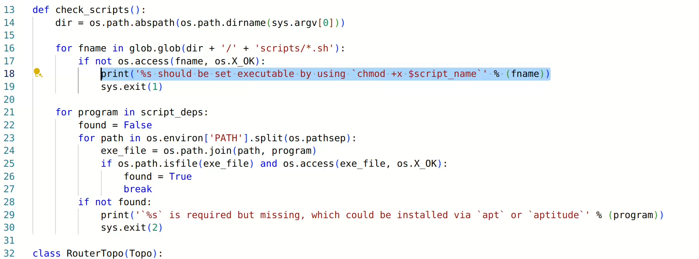

### 给框架中的脚本相应权限

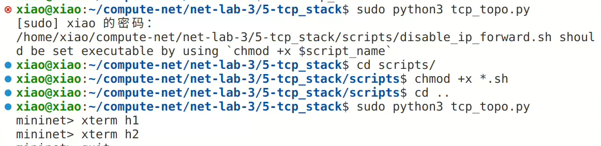

### 运行topo文件

+ 先在h1节点和h2节点中先运行 `/scripts`中的 `disable_offloading.sh`和 `disable_tcp_rst.sh`,h1运行server脚本，h2运行client脚本，结果如下：
  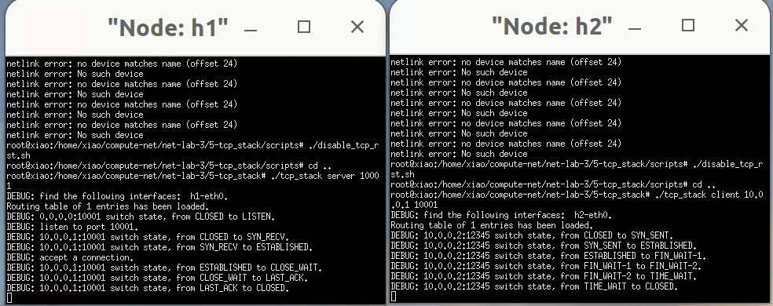
+ 使用tcp_stack.py替换任意一端，都能正确首发数据：
  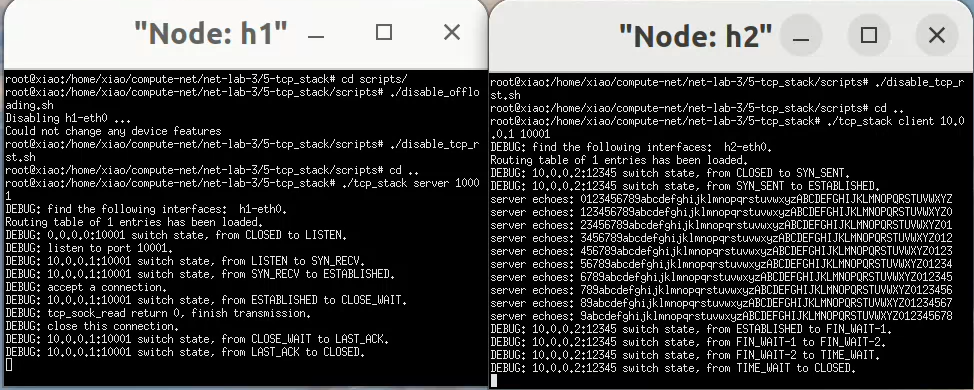
  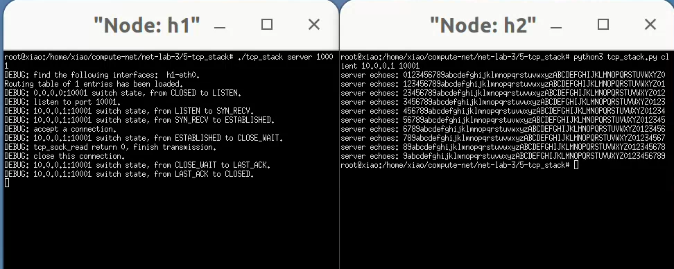

## 实验2内容

**修改tcp_apps.c(以及tcp_stack.py)，使之能够收发文件**
**执行create_randfile.sh，生成待传输数据文件client-input.dat**
**运行给定网络拓扑(tcp_topo.py)**
**在节点h1上执行TCP程序**
**在节点h2上执行TCP程序**
**使用md5sum比较两个文件是否完全相同**
**使用tcp_stack.py替换其中任意一端，对端都能正确收发数据**

## 实验过程

### 添加状态处理逻辑

### 功能描述

在 `established`状态的处理逻辑中添加处理非FIN包的处理逻辑。该代码段处理 `TCP_ESTABLISHED` 状态下接收到的包。

- 如果收到 FIN 包，表示连接请求关闭，更新接收窗口、状态变为 `TCP_CLOSE_WAIT` 并发送 ACK。
- 如果收到 PSH + ACK 包，检查是否有有效负载，如果无负载，则更新 ACK 和接收序列号；若有负载，先确保接收缓冲区不满，然后将数据写入接收缓冲区，并更新序列号、ACK，并唤醒接收线程，最后发送 ACK 包。

### 代码如下

```c
case TCP_ESTABLISHED:
    if (cb->flags & TCP_FIN) {
        tsk->rcv_nxt = cb->seq + 1;
        wait_exit(tsk->wait_recv);
        tcp_set_state(tsk, TCP_CLOSE_WAIT);
        tcp_send_control_packet(tsk, TCP_ACK);
    } 
    else if (cb->flags == (TCP_PSH | TCP_ACK)) {
        if (cb->pl_len == 0) {
            tsk->snd_una = cb->ack;
            tsk->rcv_nxt = cb->seq + 1;
            tcp_update_window_safe(tsk, cb);
        } 
        else {
            while (ring_buffer_full(tsk->rcv_buf)) {
                sleep_on(tsk->wait_recv);
            }
            pthread_mutex_lock(&tsk->rcv_buf->lock);
            write_ring_buffer(tsk->rcv_buf, cb->payload, cb->pl_len);
            pthread_mutex_unlock(&tsk->rcv_buf->lock);
            tsk->rcv_nxt = cb->seq + cb->pl_len;
            tsk->snd_una = cb->ack;
            wake_up(tsk->wait_recv);
            tcp_send_control_packet(tsk, TCP_ACK);
        }
    }
    break;
```

### int tcp_sock_read(struct tcp_sock *tsk, char *buf, int len)

### 功能描述

`tcp_sock_read` 函数用于从 TCP 套接字的接收缓冲区读取数据。它会在接收缓冲区为空时阻塞，直到数据可用。读取数据后，唤醒等待的线程，并返回读取的字节数。

### 代码如下

```c
int tcp_sock_read(struct tcp_sock *tsk, char *buf, int len) 
{
    // 如果接收缓冲区为空，则阻塞等待
    while (ring_buffer_empty(tsk->rcv_buf)) {
        if (sleep_on(tsk->wait_recv) < 0) {
            return 0;
        }
    }

    // 从接收缓冲区读取数据
    int plen = read_ring_buffer(tsk->rcv_buf, buf, len);

    // 唤醒等待的线程
    wake_up(tsk->wait_recv);
    return plen;
}
```

### int tcp_sock_write(struct tcp_sock *tsk, char *buf, int len)

### 功能描述

`tcp_sock_write` 函数用于将数据写入 TCP 套接字的发送缓冲区并通过网络发送。它将数据分割为多个数据包（每个数据包的最大大小由 `data_len` 限制），并逐个发送。当数据量不足以填充一个完整的数据包时，发送最后一个数据包。每次发送之间会有短暂的延时。

### 代码如下

```c
int tcp_sock_write(struct tcp_sock *tsk, char *buf, int len) 
{   
    int seq = tsk->snd_nxt;
    int send_len = len;
    int data_len = 1514 - ETHER_HDR_SIZE - IP_BASE_HDR_SIZE - TCP_BASE_HDR_SIZE;

    // 将数据分割并发送多个包
    while (len > data_len) {
        char *packet = (char *)malloc(1514);
        memcpy(packet + ETHER_HDR_SIZE + IP_BASE_HDR_SIZE + TCP_BASE_HDR_SIZE,
               buf + (tsk->snd_nxt - seq), data_len);
        tcp_send_packet(tsk, packet, 1514);
        usleep(10000);  // 延时
        len -= data_len;
    }

    // 发送最后一个数据包
    int pkt_size = ETHER_HDR_SIZE + IP_BASE_HDR_SIZE + TCP_BASE_HDR_SIZE + len;
    char *packet = (char *)malloc(pkt_size);
    memset(packet, 0, ETHER_HDR_SIZE + IP_BASE_HDR_SIZE + TCP_BASE_HDR_SIZE);
    memcpy(packet + ETHER_HDR_SIZE + IP_BASE_HDR_SIZE + TCP_BASE_HDR_SIZE,
           buf + (tsk->snd_nxt - seq), len);
    usleep(100000);  // 延时
    tcp_send_packet(tsk, packet, pkt_size);

    return send_len;
}
```

## 实验2结果

### 生成测试数据

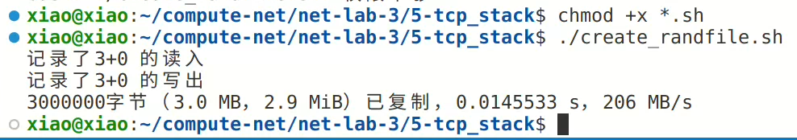

### 运行topo文件

+ 在h1上运行server，在h2上运行client：
  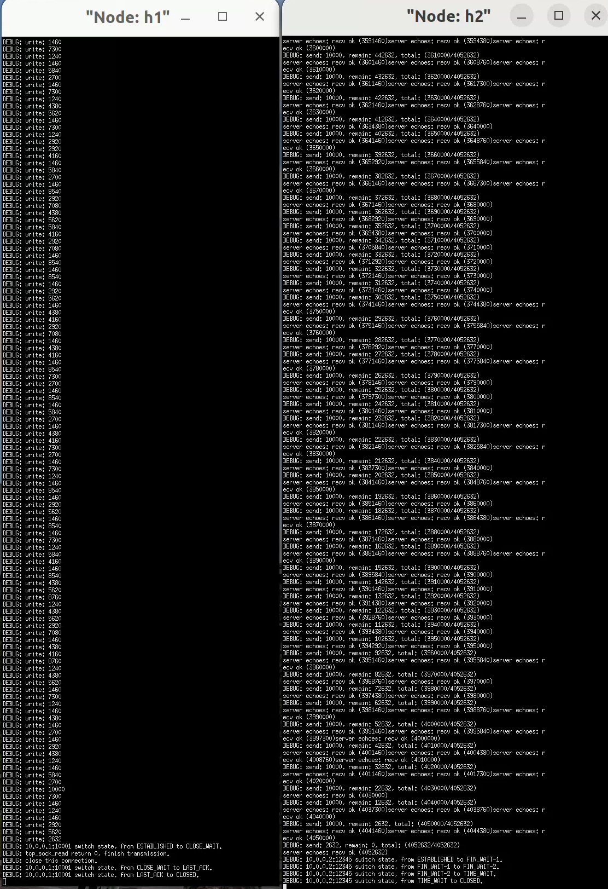
+ 使用md5sum比较两个文件是否完全相同
  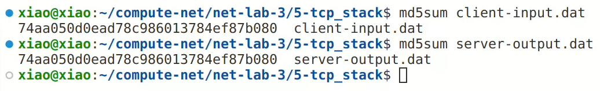
+ 使用tcp替换其中任意一端，并对比结果是否相同
  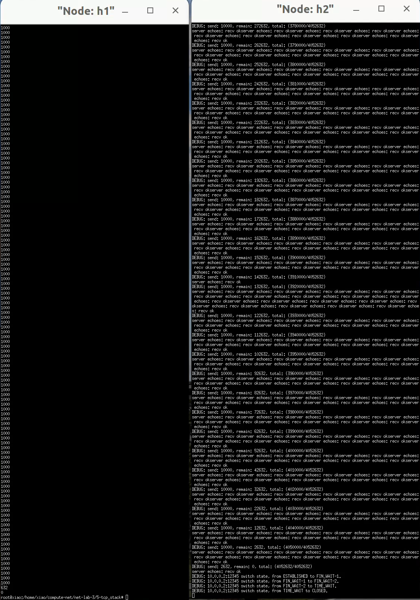
  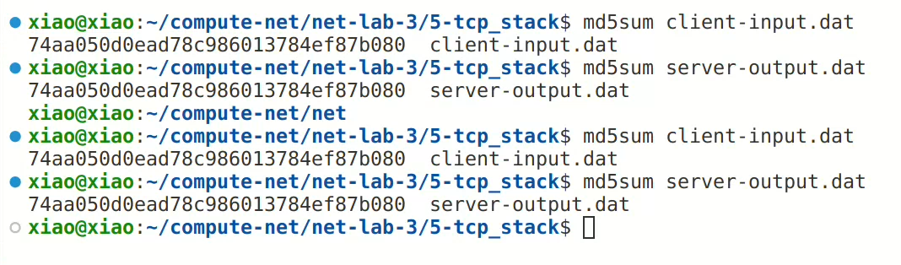
  
  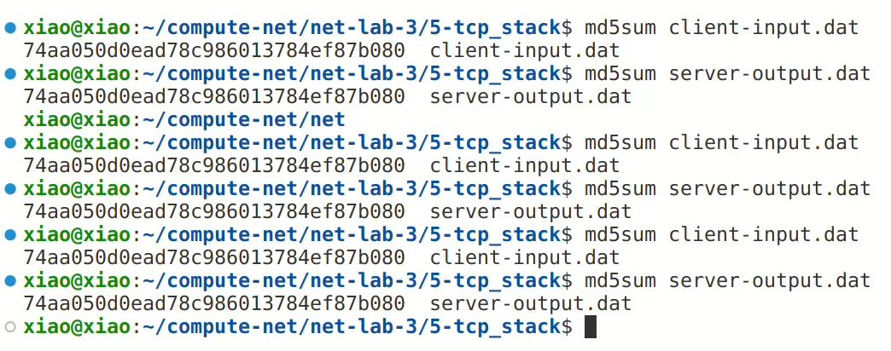
